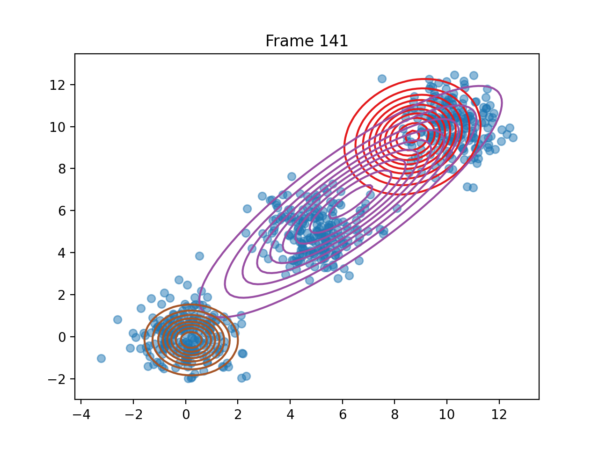
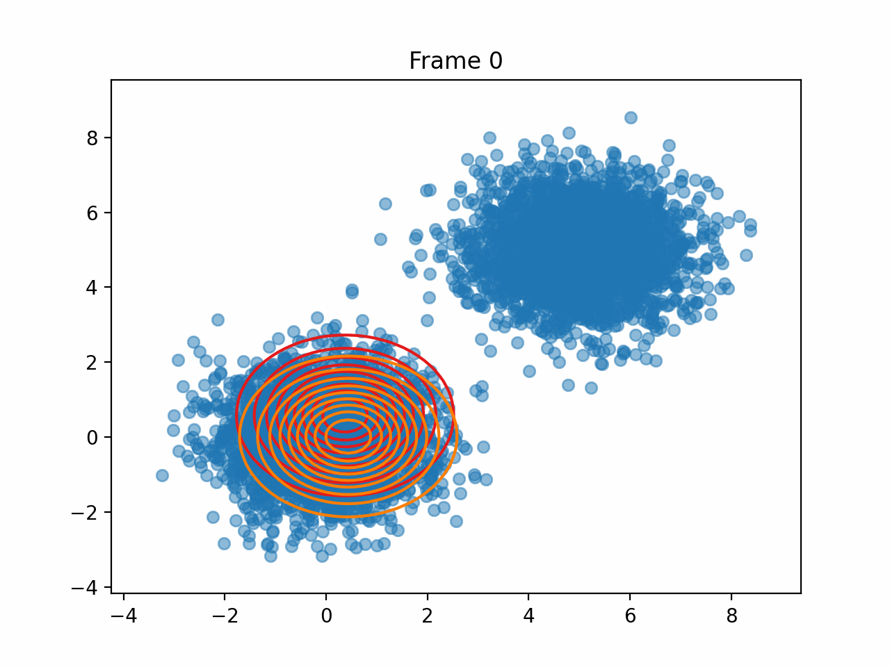

# ppem Progression log
# 13.3:
    created the basic algorithm , not yet put in a skeleton as a class that allows us to manipulate each component of the algorithm on its own
# 8.4.23 :
    created the skelaton for the em algorithm , now we need to work on the specifics of this algorithm , estep and m step should be altered using a new class for each algorithm , ppem and em , so that we can compare
 
# 7.5.23
    initial em algorithm works on all dimentions with plots that describe the final result
# 14.5.23
    full fast EM algorithm works with log likelyhood and responsabilities ,plus an added feature that represents the Plot of the algorithm throughout its life Span 
    added randomally created points with multi dimentions , although the plot works only on 2 dimentions , but the algortithm itself works on all dimentions 

# 17.5.23
    corrected the algorithm of full fast em , that wasn't working correctly , it took too much iterations for convergence 
# 25.5.23 
    worked on the idea of using k means to approximate each parameter that is recieved from the client "miu and sigma" in the server to cluster the correct parameters together then "calculate the mean of them" as the centroid 
# 30.5.23 
    The previous idea turned can alter our results ! but it's implementation on encrypted data is also hard , and takes too much time ! i don't think that this is a valid solution , 
    although we attempted to create that algorithm it just goes back in circles to the original idea " i.e  using em on all the data that comes from the clients while the data is encrypted"
# 3.6.23 
    as we discussed both mechael and i don't think that our approch is good enough unless we assume an honest but curious adversary on the servers side !
# 6.6.23 
    * we came up with the following :

    # Working on the main approach
        * client server based algorithm
            1. server side :
                * recieve the data and the standard deviations for each client 
                * use k means to approximate the parameters of the distributions 
                * apply EM algorithm on using those parameters while the parameters are encrypted
            2. each client:
                * uses BFV ecryption to encrypt it's data 
                * applies EM on its own data set 
                * sends the results to the server using a secure connection SSL 
# 8.6.23
    # updates on the algorithm itself:
        * client uses k-means to intitialize the data 
            * might send part of the information not all of it ! 
        * server might just use a part of the m step from each client.
            * if we use a different approch from homomorphic encryptions then we will use k-means on the 
                distributions themselfs then calculate the m step of the algorithm,
                meaning we will cluster the parameters of the em algorithm so that when we calculate the m step 
                it would be much more efficient ! 
        * we are exploring threshold encryption !

# 10.6.23-21.6.23
    * our approuch was flawed and wasn't even a good idea as we have as k means will be biased on certain as explained by the professor to us , and that we might need to think of a better approach .
    * in this period we were researching different Privacy Preserving k-means and em algorothims to think of a new concept.
# 1.7.23
    i am currently thinking of solutions , as we just didn't want to create the " standard " algorithm ! this might have been a mistake ! 
    although thrishold encryption seems good , i don't think that we can apply it as fully secure , maybe we can ! time will tell ! 
    there should be an option to simply split the work between the server and client while at the same time not compromising that much of security/performance 

# 3.7.23
    based on this approch :
        https://redirect.cs.umbc.edu/~kanishk1/papers/ICDM_09_P2PEM.pdf
    we are now basing our approch via a peer-to-peer concept, inspired by "A Local Scalable Distributed Expectation Maximization Algorithm for Large
    Peer-to-Peer Networks"
    

        
    in which P is each peer in a network , m is the number of data points in each peer 
    in our Implentation each peer would be a client ,and the data sent to the server would be encrypted via homomorphic encryption  
    while the E-step would be performed in each "peer"'s environment the m step would then be split between both the server and the client , 
    meaning the sums with from a=1 to m would be performed in each clients environment and the sums from i=1 to p would be performed in the servers side 
    ,
    security is garanteed if the server is an honest but curious adversary, to which we could add another layer of security to check the validity of the client 
    and the validity of the server such as Elliptic Curve Digital Signature Algorithm or Edwards-curve Digital Signature Algorithm
    to make sure that the server or client is who they say they are 
# 4.7.23
    i've already implemented the algorithm without using encryption , what remains is to check if it works and then implement the encryption scheme ! 
    the full skelaton of the algorithm is ready 
# 5.7.23 
    added more documentation to the code , and some modificiations on the Partial EM and Server(Full EM) algorithms , still not finished for the day ,
    and the full algorithm should be done by tommorow or the day after that 
    also we have started to create the finished version of the algorithm and with proofs in the paper that we are working on 

# 6.7.23 
   Partial EM and full em algorithms are done , did a test that check different parameters:
        1.number of clusters 
        2.number of parties 
        3.length of input 
        4.still haven't played with dimensions
# 8.7.23 
    we have now found out that there is another algorithm cvalled federated em algorithm and we found an article that takes exactly what we thought only applies to peer to peer em algorithm :
        Article:
                PRIVACY-PRESERVING DISTRIBUTED EXPECTATION MAXIMIZATION FOR GAUSSIAN
                MIXTURE MODEL USING SUBSPACE PERTURBATION
                Qiongxiu Li?
                , Jaron S. Gundersen†
                , Katrine Tjell† Rafal Wisniewski†
                , Mads G. Christensen?
    1.PPEM algorithm was emplemented easily do to the last step that we made , the only thing that we had to chage was adding encryption before sending the data from the clients side ! amazing progression
    2. added csv files that contain the results of the algorithms run
    3. the results are all documented according to the nameing scheme :(PPEM_n100_k2_c2) "type of the algorithm","input size","number of supposed clusteres","number of clients 
    4. might add a gradiant decsend function in the epsilone step of the exceleration !! this has been on my mind for a while now , maybe making the algorithm more aggressive can result in a good convergence rate ! 
# 10.7.23 
    1. our proposal was flawed as we didn't account for the responsibilities ! this is not good enough , we will now try to integrate the estep to be split between the server and the client

# 14.7.23
    1. the assumption that we had in the 10.7.23 was incorrect as the problem that we had while running the code was due to the fact that the server had no clue what the actual results were:
        meaning that in the server the parameters ,Pi,mean,covariance were not known thus the final visual result that we got was the original arbitrary means and covariances , not the actual results 
    2. which led us to understand another issue irrelevant to the previous point is that we shouldn't have tried calcualting the new covariances according to the new means in the m step ! 

Here we show off one of the many results using the randomly generated data :

this is an example of how the algorithm visually works , not the same one as before :

# 14.7.23 
        One more improvement on the convergence of the em algorithm : 
                initate each pi,means,covariances of each client using local em algorithm
        might even add a kmeans method to cluster the "clusters from each client" and send the mean back to each client 

# 25.7.23 
        we made an appointment with our mentor to check with her if everything we have done so far is a great  approch and if there is a need for imporvment 
# 8.8.23
        we started writing the article we and have finished section 1 of the article including the introduction in latex using overleaf
#15.8.23 
        we finished the second part of the article that explains the general federated em algorithm + some essintial background 
#22.8.23 
        we worked on our approuch and explained it .
# 27.8.23 
        we worked on the algorithm itself and laid it's psudo code , and we are doing some background search for the ckks approuch + ways to prove our approuche's privacy
# 5.9.23 
        we found some articles that support our lemma that 2 different cypher codes are indistinguishable one from the other , meaning we cannot know which is which 
        we also added some of the citations
# 10.9.23 
        finished writing the privacy and correctness sections based on the above informations 
# 12.9.23 
        we are working on getting the results for parkensons dataset to put them in the article and show our results 
# 13.9.23 
        points to maybe change in the latest :=]  sdfasd
# 7.8.23
    started to work on the latex document ,finished the first section.
# 14.8.23 
    michael introduced the em algorithm in the paper.
    abed reshaped the whole document so that it would be readable 
# 20.8.23 
    expanded more on the federated em in the paper plus the GMM equations and the federated em equations and steps plus the federated em over netwroks introduction in overleaf
    the privacy leakage should be added as that is what we are correcting or improving in the federated em algorithm 
    also we need to add our approuche's privacy proof 
# 21.8.23 
    
