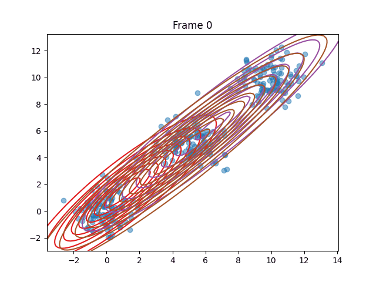

# ppemAlgorithmPrototype

# 8.4.23 :
  * created the skelaton for the em algorithm , now we need to work on the specifics of this algorithm , estep and m step should be altered using a new class for each algorithm , ppem and em , so that we can compare
 
# 7.5.23
  * initial em algorithm works on all dimentions with plots that describe the final result
# 14.5.23
  * full fast EM algorithm works with log likelyhood and responsabilities ,plus an added feature that represents the Plot of the algorithm throughout its life Span 
  * added randomally created points with multi dimentions , although the plot works only on 2 dimentions , but the algortithm itself works on all dimentions 

