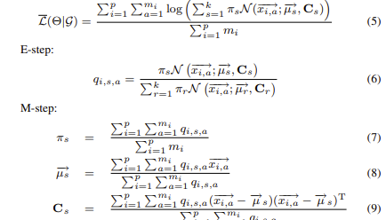

# ppemAlgorithmPrototype
# 13.3:
    created the basic algorithm , not yet put in a skeleton as a class that allows us to manipulate each component of the algorithm on its own
# 8.4.23 :
  * created the skelaton for the em algorithm , now we need to work on the specifics of this algorithm , estep and m step should be altered using a new class for each algorithm , ppem and em , so that we can compare
 
# 7.5.23
  * initial em algorithm works on all dimentions with plots that describe the final result
# 14.5.23
  * full fast EM algorithm works with log likelyhood and responsabilities ,plus an added feature that represents the Plot of the algorithm throughout its life Span 
  * added randomally created points with multi dimentions , although the plot works only on 2 dimentions , but the algortithm itself works on all dimentions 

# 17.5.23
    * corrected the algorithm of full fast em , that wasn't working correctly , it took too much iterations for convergence 
# 25.5.23 
    * worked on the idea of using k means to approximate each parameter that is recieved from the client "miu and sigma" in the server to cluster the correct parameters together then "calculate the mean of them" as the centroid 
# 30.5.23 
    * The previous idea turned can alter our results ! but it's implementation on encrypted data is also hard , and takes too much time ! i don't think that this is a valid solution , 
    * although we attempted to create that algorithm it just goes back in circles to the original idea " i.e  using em on all the data that comes from the clients while the data is encrypted"
# 3.6.23 
    * as we discussed both mechael and i don't think that our approch is good enough unless we assume an honest but curious adversary on the servers side !
# 6.6.23 
    * we came up with the following :

    # Working on the main approach
        * client server based algorithm
            1. server side :
                * recieve the data and the standard deviations for each client 
                * use k means to approximate the parameters of the distributions 
                * apply EM algorithm on using those parameters while the parameters are encrypted
            2. each client:
                * uses BFV ecryption to encrypt it's data 
                * applies EM on its own data set 
                * sends the results to the server using a secure connection SSL 
    # updates on the algorithm itself:
        * client uses k-means to intitialize the data 
            * might send part of the information not all of it ! 
        * server might just use a part of the m step from each client.
            * if we use a different approch from homomorphic encryptions then we will use k-means on the 
                distributions themselfs then calculate the m step of the algorithm,
                meaning we will cluster the parameters of the em algorithm so that when we calculate the m step 
                it would be much more efficient ! 
        * we are exploring threshold encryption !
    
# 1.7.23
    * i am currently thinking of solutions , as we just didn't want to create the " standard " algorithm ! this might have been a mistake ! 
    * although thrishold encryption seems good , i don't think that we can apply it as fully secure , maybe we can ! time will tell ! 

# 3.7.23 
    we are now basing our approch via a peer-to-peer concept, inspired by "A Local Scalable Distributed Expectation Maximization Algorithm for Large
    Peer-to-Peer Networks"
    

    in which P is each peer in a network , m is the number of data points in each peer 
    in our Implentation each peer would be a client ,and the data sent to the server would be encrypted via homomorphic encryption  
    while the E-step would be performed in each "peer"'s environment the m step would then be split between both the server and the client , 
    meaning the sums with from a=1 to m would be performed in each clients environment and the sums from i=1 to p would be performed in the servers side 

    ,
    security is garanteed if the server is an honest but curious adversary, to which we could add another layer of security to check the validity of the client 
    and the validity of the server such as Elliptic Curve Digital Signature Algorithm or Edwards-curve Digital Signature Algorithm
    to make sure that the server or client is who they say they are 
# 4.7.23 
    i've already implemented the algorithm without using encryption , what remains is to check if it works and then implement the encryption scheme ! 
    the full skelaton of the algorithm is ready 